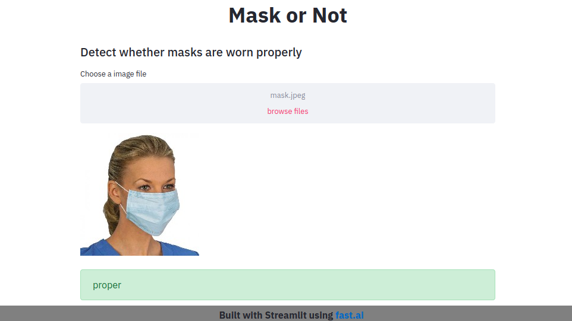

# mask-or-not

Simple mask detection app made using [fast.ai vision](https://docs.fast.ai/vision.html) & [streamlit.io](https://www.streamlit.io/) :sparkling_heart:.

find more details in the notebook.

*wear a mask, stop the spread* :mask:

.

PS: Don't mind the accuracy.
